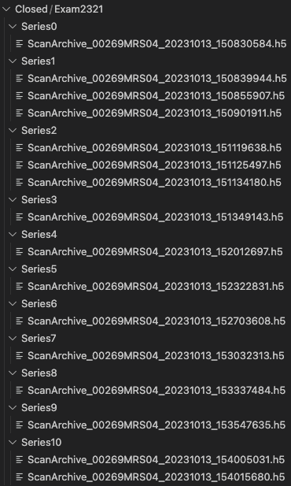
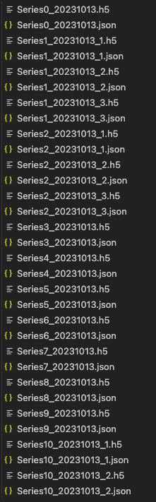
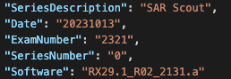

# Details

Given the directory of an exam (example shown below) the script will move, rename and create a .json file for each .h5 file found in the folder (or within folders of the folder)

 
## Naming convention

The naming convention used is: _Series_**(number)**_\_YYYYMMDD.h5_

The date is when the scan occured.

If there are multiple .h5 files in a Series folder the naming convention is changed to: _Series_**(number)**_\_YYYYMMDD\__**\(number of file in folder\)**_.h5_

## Json File Contents
The json file has the following information:
- series description
- date
- exam number
- series number
- software used

